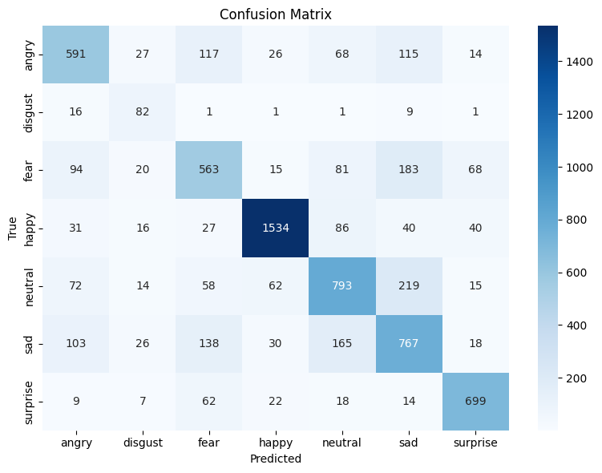
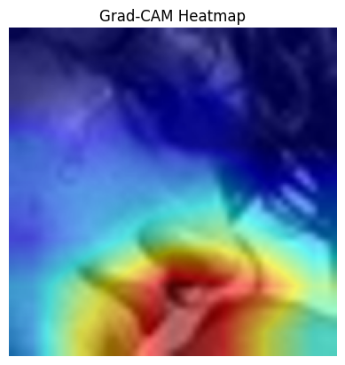

# Facial Emotion Recognition with CNN and Transfer Learning

This project implements a Facial Emotion Recognition system using deep learning models such as **ResNet34** and **EfficientNetB0** on the **FER2013** dataset. It uses PyTorch and includes model training, evaluation, Grad-CAM visualization, and single-image prediction.

---

## 📂 Project Structure

facial-emotion-recognition/  
|── models.py # Custom CNN models (ResNet34, EfficientNetB0)  
    |── model_setup.py  
    |── resnet_model.py  
    |── efficientnet_model.py  
|── train.py # Training loop and model saving  
|── evaluate.py # Model evaluation, classification report, confusion matrix  
|── predict.py # Single image prediction  
|── utils.py # Transforms, dataloaders, config, helper functions  
|── config.py # Hyperparameters and paths  
|── requirements.txt # Python dependencies  
|── README.md # Project documentation  
|── assets/ # Output plots and visualizations (optional)  
    |── gradcam.py  
|── main.py # the whole code in one place  

---

## 📌 Features

- ✅ Transfer learning with **ResNet34** and **EfficientNetB0**
- ✅ Support for grayscale input images
- ✅ Training/validation split handling
- ✅ Grad-CAM for interpretability
- ✅ Classification metrics and confusion matrix
- ✅ Single image prediction

---

## 📊 Dataset

FER2013 is a public dataset of 48x48 pixel grayscale images categorized into 7 emotions:

- `angry`, `disgust`, `fear`, `happy`, `sad`, `surprise`, `neutral`

To download the dataset:

kaggle datasets download -d msambare/fer2013  
unzip fer2013.zip -d fer2013_data

=======
## 🛠️ Installation
Clone the repository and install dependencies:  
git clone https://github.com/HnaKsa/facial-emotion-recognition-project  
cd facial-emotion-recognition  
pip install -r requirements.txt  

## ⚙️ Configuration
Edit config.py to change training parameters:  
batch_size = 64  
epochs = 20  
lr = 0.0001  
train_dir = r"D:\facial-emotion-recognition-cnn-dataset\train"  
val_dir = r"D:\facial-emotion-recognition-cnn-dataset\test"  

## 🚀 Training
To train the model:  
python train.py  

This saves:  
emotion_model_resnet34.pth – trained model  
Training/validation loss and accuracy plots  

## 📈 Evaluation
To evaluate the model:  
python evaluate.py  

This prints:  
Classification report  
Confusion matrix  

## 🔍 Single Image Prediction
To predict on a new image:  
python predict.py --img_path path/to/image.jpg  

## 🔥 Grad-CAM Visualization
Grad-CAM highlights important regions in the image:  
python gradcam.py --img_path path/to/image.jpg  

## 📦 Requirements
txt  
Copy  
Edit  
torch  
torchvision  
matplotlib  
seaborn  
scikit-learn  
pillow  
numpy  
pytorch-grad-cam  
Install with:  
pip install -r requirements.txt  

## 📸 Example Results
  
  

## 📄 License
This project is released under the MIT License.  

## 🙌 Acknowledgements
FER2013 dataset on Kaggle  
PyTorch documentation  
Papers with Code & torchvision models  

## 💡 Future Improvements
Add early stopping  
Support multi-model ensemble  
Export to ONNX or TorchScript for deployment  
